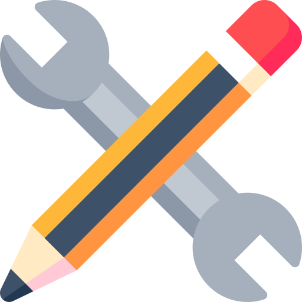
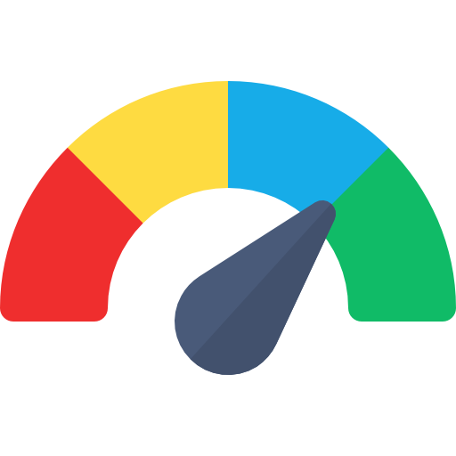
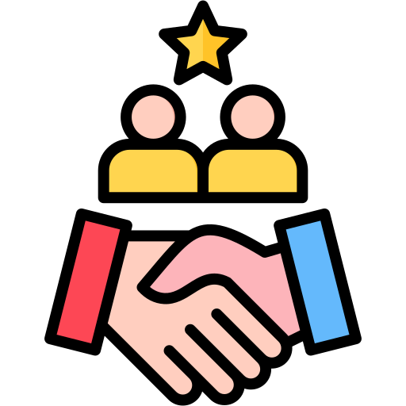
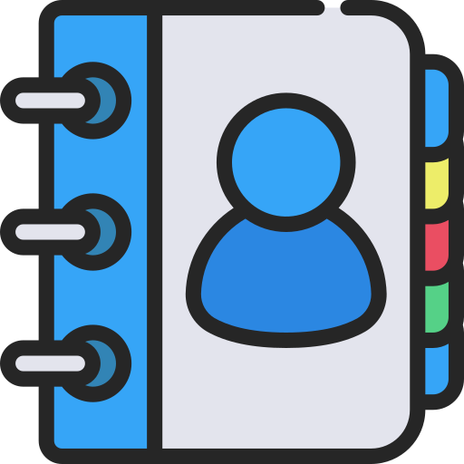

<!--Banner-->

<!--Header Name-->
<h1 align="center"
    style="font-size: 40px;
    text-transform: uppercase;
    margin-top:-30px;">
    <strong>𝙇𝘼 𝙑𝙄𝙀 𝘾'𝙀𝙎𝙏 𝙋𝘼𝙎 𝙐𝙉 𝙋𝙄𝘾𝙉𝙄𝘾 !</strong>
</h1>

    By Speedybac 2026

<!--Start Intro-->     
## Qui suis-je 
          

✨ Formateur en Reconditionnement informatique et president de l'Association Le Garage Numerique depuis Mars 2024

Designer graphique passionné par la Tech DIY, la création de piece 3D aisi que de l'impression 3D, l'électronique, la soudure électronique, l'installation et la réparation d'ordinateurs. Je suis fasciné par l'univers de la technologie et je me passionne pour trouver des solutions innovantes pour améliorer les expériences des utilisateurs.

**Mes passions :** 

*   Design graphique : je me consacre à la création de designs visuels qui aident les marques à se démarquer et à communiquer leur message de manière efficace.
*   Tech DIY : je suis un grand fan de la DIY (do-it-yourself) et je m'intéresse à la création de projets électroniques et de démonstration de systèmes complexes de manière accessible.
*   Électronique : je suis fasciné par les principes fondamentaux de l'électronique et je me passionne pour l'apprentissage de nouveaux technologies et de nouveaux matériaux.

**Mes compétences :** 

*   Design graphique : je suis compétent en design graphique, en création de maquettes, en conception de interfaces utilisateur et en création de contenus visuels.
*   Soudure électronique : je suis compétent en soudure électronique et je peux réaliser des projets électroniques de base.
*   Installation et réparation d'ordinateurs : je suis compétent en installation et réparation d'ordinateurs, y compris la mise à niveau des composants et des systèmes.
   
<!--End Intro-->

<!--Tech Stack-->
<h2 align="center">
    <strong>
        
        TECH STATS
        
    </strong>
</h2>
 

 

<!--End Tech Stack-->
 
<!--Github stats Table--> 
<h2 align="center">
    
        <strong>GITHUB STATS</strong>
    
</h2>

<table width="100%">
    <tr>
        <td width="50%">
            <h3 align="center">GITHUB STATS</h3>
            

                
            

        </td>
        <td width="50%">
            <h3 align="center">STREAK STATS</h3>
            

                
            

        </td>
    </tr>
    <tr>
        <td width="50%">
            <h3 align="center">LATEST PROJECT</h3>
            

                
            

        </td>
        <td width="50%">
            <h3 align="center">TOP CONTRIBUTIONS</h3>
            

                
            

        </td>
    </tr>
</table>

 

<!--Contribution Graph-->
<h2 align="center">
    
    <strong>CONTRIBUTIONS GRAPH</strong>
    
</h2>

  

    

 
 

<!--Contact Section--> 

<h2 align="center">
    
    <strong>Connect With Me</strong>
     
</h2>
 

    
    

  

<!--Buy me a coffee-->

    

 
<!--Footer--> 

    

<!--
**Speedybac223/Speedybac223** is a ✨ _special_ ✨ repository because its `README.md` (this file) appears on your GitHub profile.

Here are some ideas to get you started:

- 🔭 I’m currently working on ...
- 🌱 I’m currently learning ...
- 👯 I’m looking to collaborate on ...
- 🤔 I’m looking for help with ...
- 💬 Ask me about ...
- 📫 How to reach me: ...
- 😄 Pronouns: ...
- ⚡ Fun fact: ...
-->
